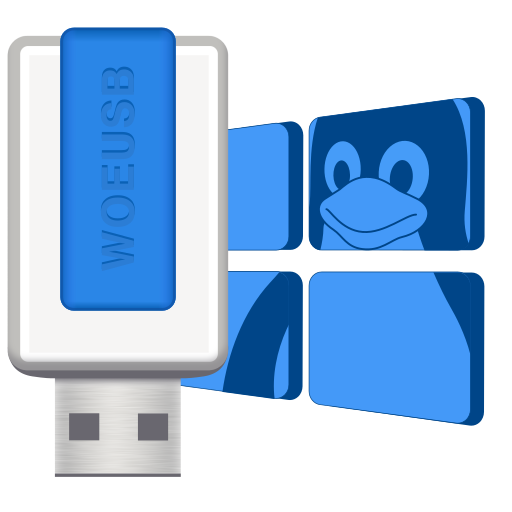

<div align="center">
<h1>WowUSB-DS9</h1>

</div>

_A Linux program to create a Windows USB stick installer from a real Windows DVD or image with advanced filesystem support and Windows-To-Go capability._

**NEW: WowUSB-DS9 now supports large ISO files (>4GB) through NTFS, exFAT, F2FS and BTRFS filesystem support, plus Windows-To-Go functionality!**

This package contains two programs:

* **wowusb**: A command-line utility that enables you to create your own bootable Windows installation USB storage device or a powerful multiboot USB.
* **woeusbgui**: Graphic version of wowusb.

## Features

*   Support for Windows Vista, Windows 7, Window 8.x, Windows 10, and Windows 11 for standard USB creation.
*   **Multiboot Capabilities:**
    *   Create a GRUB2-based multiboot USB drive.
    *   Include a Windows-To-Go installation on a dedicated NTFS partition.
    *   Add multiple Linux ISOs for direct booting from the GRUB menu.
    *   Optionally perform a full Linux installation (Debian, Ubuntu, Arch) to an F2FS partition, also bootable from GRUB.
    *   Customizable GPT partition layout: ESP (FAT32), BIOS_GRUB, Windows (NTFS), Payload/Data (F2FS default).
*   Advanced Filesystem Support:
    *   Automatic selection based on ISO content for standard mode: FAT32, NTFS, exFAT, F2FS, BTRFS.
    *   F2FS is prioritized for payload partitions in multiboot mode, with fallback to exFAT, NTFS, BTRFS.
*   Windows-To-Go support (both in standard mode and as part of multiboot).
*   Boots in both Legacy/MBR-style (via `i386-pc` GRUB) and UEFI mode (via `x86_64-efi` GRUB).
*   Automatic detection of large files (>4GB) for appropriate filesystem selection in standard mode.

This project is a significant enhancement of the original [WoeUSB](https://github.com/slacka/WoeUSB) and [WoeUSB-ng](https://github.com/WoeUSB/WoeUSB-ng) projects.

## Installation

### Option 1: PyPI Package (All Linux Distributions)

```shell
# Install dependencies (example for Debian/Ubuntu)
# Core:
sudo apt install git p7zip-full python3-pip python3-wxgtk4.0 parted wipefs
# Filesystems:
sudo apt install dosfstools ntfs-3g exfat-utils f2fs-tools btrfs-progs
# GRUB & Multiboot:
sudo apt install grub-common grub-pc-bin grub-efi-amd64-bin gdisk # gdisk for sgdisk
# Optional for Full Linux Install:
# sudo apt install debootstrap # For Debian/Ubuntu
# For Arch, ensure 'arch-install-scripts' (provides pacstrap) is installed from Arch repos.

# Install WowUSB-DS9
sudo pip3 install WowUSB-DS9
```

### Option 2: Debian Package (.deb)

```shell
# Download the latest .deb package from the releases page
wget https://github.com/rebots-online/WowUSB/releases/latest/download/wowusb-ds9_X.Y.Z-1_all.deb # Replace X.Y.Z

# Install the package (this should pull in most dependencies if correctly packaged)
sudo apt install ./wowusb-ds9_X.Y.Z-1_all.deb
```

### Option 3: Arch Linux

WowUSB-DS9 might be available in the AUR. Check for `wowusb-ds9` or a similar name.
```shell
yay -S wowusb-ds9 # Or your preferred AUR helper
```
Ensure system dependencies like `grub`, `gdisk`, `arch-install-scripts` (for full Arch install) are met.

### Option 4: Generic Linux Package (tar.gz)

Refer to the installation script within the tarball and ensure all dependencies from the "Dependency Requirements" table are met.

### Option 5: Installation from Source Code

Clone the repository and run `sudo pip3 install .`. Ensure all dependencies from the "Dependency Requirements" table are met.
```shell
# Example for Debian/Ubuntu:
sudo apt install git p7zip-full python3-pip python3-wxgtk4.0 parted wipefs dosfstools ntfs-3g exfat-utils f2fs-tools btrfs-progs grub-common grub-pc-bin grub-efi-amd64-bin gdisk debootstrap
git clone https://github.com/rebots-online/WowUSB.git
cd WowUSB
sudo pip3 install .
```

## Dependency Requirements

This table lists key system packages. Python dependencies (`termcolor`, `wxPython`) are handled by `pip`.

| Feature Area                | Debian/Ubuntu Packages                                                                 | Fedora Packages                                                                                      | Arch Linux Packages                                                                     |
|-----------------------------|----------------------------------------------------------------------------------------|------------------------------------------------------------------------------------------------------|-----------------------------------------------------------------------------------------|
| **Core & GUI**              | `python3-pip python3-wxgtk4.0 p7zip-full parted wipefs`                                  | `python3-pip python3-wxpython4 p7zip p7zip-plugins parted wipefs`                                        | `python-pip python-wxpython p7zip parted wipefs`                                          |
| **Filesystems**             | `dosfstools ntfs-3g exfat-utils f2fs-tools btrfs-progs`                                  | `dosfstools ntfs-3g exfatprogs f2fs-tools btrfs-progs`                                                 | `dosfstools ntfs-3g exfatprogs f2fs-tools btrfs-progs`                                    |
| **GRUB & Multiboot Core**   | `grub-common grub-pc-bin grub-efi-amd64-bin gdisk`                                       | `grub2-common grub2-tools grub2-efi-x64-cdboot gdisk` (ensure grub2-tools provides grub-install etc.) | `grub gdisk` (ensure efibootmgr is also installed for GRUB EFI)                       |
| **Full Linux Install (Opt.)**| `debootstrap`                                                                          | `debootstrap` (if installing Debian/Ubuntu)                                                          | `arch-install-scripts` (if installing Arch)                                             |

*Note: Package names can vary slightly between distributions and versions. `exfat-utils` might be `exfatprogs` on newer systems.*
*`gdisk` provides `sgdisk`. `wipefs` is usually part of `util-linux`.*

## Usage

### Command Line Interface

**Standard (Single Windows Install) Mode:**

```shell
wowusb --device <Windows_ISO_or_DVD_Device> <Target_USB_Device>
# Example: wowusb --device windows10.iso /dev/sdb
```

Standard mode advanced options:

```shell
# Specify filesystem for the Windows partition
wowusb --device windows10.iso /dev/sdb --target-filesystem NTFS

# Create a standard Windows-To-Go USB (not multiboot)
wowusb --device windows10.iso /dev/sdb --wintogo

# Install to an existing partition (less common for Windows)
wowusb --partition windows10.iso /dev/sdb1
```

**Multiboot Mode:**

```shell
wowusb --multiboot --target <Target_USB_Device> \
       --win-iso <Path_to_Windows_ISO> \
       --win-size-gb <Size_for_Windows_Partition> \
       --linux-iso <Path_to_Linux_ISO_1> \
       --linux-iso <Path_to_Linux_ISO_2> \
       --payload-fs <F2FS|EXFAT|NTFS|BTRFS> \
       --full-linux-install <ubuntu|arch|debian> \
       --full-linux-release <Distro_Release_Codename> \
       --http-proxy <Proxy_URL_for_Linux_Install>
```

Example for Multiboot:
```shell
# Create a multiboot USB with Windows 10 To-Go, an Ubuntu ISO, and a full Arch Linux install
sudo wowusb --multiboot --target /dev/sdc \
            --win-iso /path/to/windows10.iso --win-size-gb 64 \
            --linux-iso /path/to/ubuntu-desktop.iso \
            --full-linux-install arch --payload-fs F2FS \
            --verbose
```

*   Use `wowusb --help` to see all available options.

### Graphical Interface

```shell
woeusbgui
```

## Uninstallation

### PyPI Package

```shell
sudo pip3 uninstall WowUSB-DS9
sudo rm /usr/share/icons/WowUSB-DS9/icon.ico \
    /usr/share/applications/WowUSB-DS9.desktop \
    /usr/local/bin/woeusbgui
sudo rmdir /usr/share/icons/WowUSB-DS9/
```

### Debian Package

```shell
sudo apt remove wowusb-ds9
```

### Generic Linux Package

```shell
sudo ./uninstall.sh
```

## Advanced Filesystem and Multiboot Features

### Standard Mode Filesystem Selection
WowUSB-DS9 automatically detects if your Windows ISO contains files larger than 4GB and selects the appropriate filesystem for the main Windows partition in standard mode:

| Filesystem | Used When                                     | Requirements                     | Features                                                             |
|------------|-----------------------------------------------|----------------------------------|----------------------------------------------------------------------|
| FAT32      | Default if no large files & FAT32 available   | `dosfstools`                       | Most compatible, 4GB file size limit                                |
| F2FS       | Preferred if available (large or small files) | `f2fs-tools`                     | Flash-friendly, good performance, large file support                  |
| exFAT      | Preferred fallback if F2FS not available    | `exfat-utils` or `exfatprogs`    | Optimized for flash, large files, good cross-platform compatibility   |
| NTFS       | Fallback if F2FS/exFAT not available        | `ntfs-3g`                        | Windows-native, large files, slower on flash without UEFI:NTFS driver |
| BTRFS      | Fallback if others not available              | `btrfs-progs`                    | Advanced features, large files                                      |

The selection order for standard mode (if large files are present or `AUTO` is chosen) is generally: F2FS -> exFAT -> NTFS -> BTRFS. If no large files, FAT32 is also considered early.

### Multiboot Mode Partitioning and Filesystems
In `--multiboot` mode, WowUSB-DS9 creates a specific GPT partition layout:
1.  **EFI System Partition (ESP):** 512MB, FAT32. Contains GRUB EFI bootloader and common GRUB files (config, themes, Linux ISOs).
2.  **BIOS Boot Partition:** 1MB. For GRUB's BIOS bootloader code (`core.img`).
3.  **Windows-To-Go Partition:** NTFS, user-defined size (default 64GB). For the Windows installation.
4.  **Payload/Data Partition:** Default F2FS, uses remaining space. Can be changed with `--payload-fs`. This partition is used for the full Linux installation if selected, or as a general data partition.

### Full F2FS-based Linux Installation
When using `--full-linux-install` with `--multiboot`, a basic version of the selected distribution (Ubuntu, Debian, or Arch) is installed onto the F2FS (or chosen payload filesystem) partition. This installation is made bootable via the GRUB menu.

For detailed information on implementation, see the [TECHNICAL_DESIGN.md](docs/TECHNICAL_DESIGN.md) file.

## Documentation

- [User Guide](USER_GUIDE.md) - Detailed usage instructions
- [Troubleshooting Guide](TROUBLESHOOTING.md) - Solutions to common issues
- [Technical Design](TECHNICAL_DESIGN.md) - Implementation details
- [Changelog](CHANGELOG.md) - Version history and changes
- [Release Notes](RELEASE_NOTES.md) - Detailed information about the latest release

## License

WowUSB-DS9 is distributed under the [GPL license](COPYING).

