# WowUSB Documentation Map

This document provides a visual map of the WowUSB project's documentation structure, located primarily within this `docs/` directory.

```mermaid
graph TD
    A[WowUSB Documentation Root: /docs] --> B(Design Documents)
    A --> C(User Information & Guides)
    A --> D(Development & Contribution)
    A --> E(Release, Planning & Checklists)
    A --> F(Testing, Specifications & Summaries)

    B --> B1[ARCHITECTURE.md]
    B --> B2[TECHNICAL_DESIGN.md]
    B --> B3[MULTIBOOT_DESIGN.md]
    B --> B4[UI_FLOW_ASSESSMENT.md]

    C --> C1[USER_GUIDE.md]
    C --> C2[TROUBLESHOOTING.md]
    C --> C3["README.md (in project root)"]
    C --> C4[README-ENHANCED.md]

    D --> D1[CONTRIBUTING.md]
    D --> D2[F2FS_LINUX_SPEC.md]
    D --> D3[WINDOWS11_TO_GO_SPEC.md]

    E --> E1[CHANGELOG.md]
    E --> E2[RELEASE_NOTES.md]
    E --> E3[ROADMAP.md]
    E --> E3_balanced[ROADMAP-BALANCED.md]
    E --> E4["CHECKLIST.md (Old - Review/Archive)"]
    E --> E4_balanced["CHECKLIST-BALANCED.md (Old - Review/Archive)"]
    E --> E5[PRODUCTION_BUILD.md]
    E --> E6["Initial-Planning-exfat-ntfs-addition-....md (Review/Archive)"]

    F --> F1[F2FS_BTRFS_TEST_PLAN.md]
    F --> F2[IMPLEMENTATION_SUMMARY.md]

    %% New Checklist Location
    ProjectRoot["/ (Project Root)"] --> G(Checklists Directory @ /checklists)
    G --> G1["RELEASE_CHECKLIST_20250601_050714.md (New)"]
```

This map helps navigate the various documents and understand their categorization.
