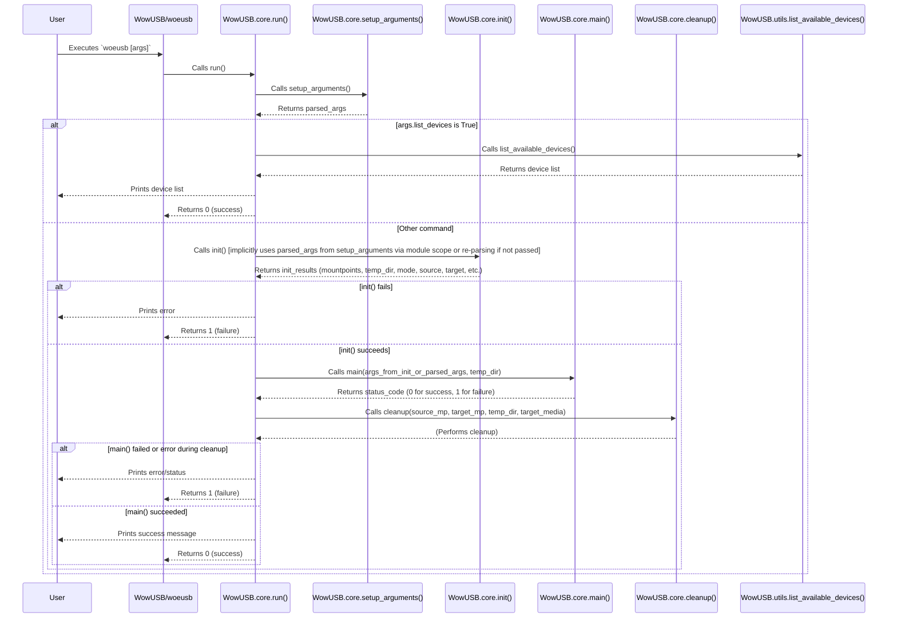

# WowUSB-DS9: CLI Flow

This document outlines the typical control flow when a user interacts with WowUSB-DS9 via the command-line interface (`woeusb`).

## 1. Entry Point: `WowUSB/woeusb`

The script `WowUSB/woeusb` is a simple Python script that serves as the primary entry point for the CLI.

```python
# WowUSB/woeusb (simplified)
import WoeUSB.core # In actual code, it's WowUSB.core

WoeUSB.core.run() # In actual code, it's WowUSB.core.run()
```

Its sole responsibility is to import the `WowUSB.core` module and execute its `run()` function.

## 2. Core Execution: `WowUSB.core.run()`

The `run()` function in `WowUSB/core.py` orchestrates the CLI operations.



**Flow Breakdown:**

1.  **Execution:** The user runs `woeusb` from the terminal with various arguments (e.g., `--device source.iso /dev/sdX`, `--list-devices`).
2.  **`WowUSB.core.run()` is Called.**
3.  **Argument Parsing (`core.setup_arguments()`):**
    *   This function (defined within `core.py`) uses `argparse` to define and parse all command-line arguments.
    *   It handles options like `--device`, `--partition`, `--target-filesystem`, `--wintogo`, `--multiboot`, `--list-devices`, `--verbose`, source, and target.
    *   It performs initial validation (e.g., WinToGo requires device mode, persistence size).
    *   It returns a namespace object containing the parsed arguments.
4.  **Handle `--list-devices`:**
    *   If `args.list_devices` is true, `core.run()` calls `WowUSB.utils.list_available_devices()` to get information about storage devices.
    *   The device list is printed to the console.
    *   The program exits.
5.  **Initialization (`core.init()`):**
    *   This function is called. *Note: The provided `core.py` has a slightly convoluted `init()` that seems to be designed for both CLI and GUI usage. In the CLI path, it re-parses arguments if they are not passed directly, which happens if `run()` calls `init()` without the `args` from `setup_arguments()`. Assuming `setup_arguments()` results are available to the subsequent `main` call within `run()`.*
    *   More accurately, `run()` calls `init()` which internally calls `setup_arguments()` if `from_cli=True` (default).
    *   `init()` sets up:
        *   Source and target mount point paths (e.g., `/media/wowusbeds9_source_...`).
        *   A temporary directory (e.g., `/tmp/WowUSB.XXXXXX`).
        *   Retrieves values from the parsed arguments (source media, target media, install mode, filesystem type, label, flags like `workaround_bios_boot_flag`, `skip_legacy_bootloader`, `verbose`, `debug`).
    *   It returns a list of these initialized parameters.
6.  **Main Processing (`core.main(args, temp_dir)`):**
    *   The `core.main()` function (the one that takes `args` from `setup_arguments` and `temp_dir`) is called with the necessary parameters.
    *   **If in `multiboot` mode:**
        *   It imports `WowUSB.multiboot`.
        *   Validates multiboot parameters (target device, OS configurations).
        *   Calls `multiboot.create_multiboot_usb()` to handle the multi-boot creation process.
        *   Returns the status from the multiboot operation.
    *   **If in `device` or `partition` mode (traditional flow, needs refactoring based on current `core.py` structure):**
        *   The older `main(source_fs_mountpoint, target_fs_mountpoint, ...)` function is called (this part of `core.py` has conflicting `main` function definitions; the `run` function seems to call the older `main` after `init`).
        *   This older `main` function executes the primary USB creation logic:
            *   Dependency checks (`utils.check_runtime_dependencies`).
            *   Parameter validation (`utils.check_runtime_parameters`).
            *   Device/partition busy checks.
            *   Mounting source (`mount_source_filesystem`).
            *   Filesystem selection and validation (`fs_handlers.get_optimal_filesystem_for_iso`, `fs_handler.check_dependencies`, checking for large files).
            *   Windows-To-Go specific preparations (`create_wintogo_partition_layout`, driver/TPM workarounds).
            *   Partitioning and formatting the target device/partition (`wipe_existing_partition_table_and_filesystem_signatures`, `create_target_partition_table`, `create_target_partition`, `create_uefi_ntfs_support_partition`).
            *   Mounting the target (`mount_target_filesystem`).
            *   Free space check.
            *   Copying files (`copy_filesystem_files` with `ReportCopyProgress` thread).
            *   Linux persistence setup (`setup_linux_persistence`).
            *   Applying workarounds (`workaround.support_windows_7_uefi_boot`).
            *   Installing legacy GRUB bootloader (`install_legacy_pc_bootloader_grub`, `install_legacy_pc_bootloader_grub_config`).
            *   Applying buggy motherboard workarounds.
        *   Returns 0 on success, 1 on failure.
7.  **Error Handling:**
    *   Throughout the process, if errors occur (e.g., failed mount, insufficient space, command failure), error messages are printed (often using `utils.print_with_color`), and the function typically returns a non-zero exit code.
    *   `KeyboardInterrupt` (Ctrl+C) is caught to allow graceful exit.
8.  **Cleanup (`core.cleanup()`):**
    *   This function is called in a `finally` block within `core.run()`, ensuring it executes regardless of success or failure (unless a very early exit occurs).
    *   It attempts to:
        *   Stop the file copy progress thread if it's running.
        *   Unmount the source filesystem (`cleanup_mountpoint`).
        *   Unmount the target filesystem (`cleanup_mountpoint`).
        *   Remove the temporary directory (`shutil.rmtree`).
    *   Prints final status messages (e.g., "You may now safely detach the target device").
9.  **Exit:** The `woeusb` script exits with the status code returned by `core.run()` (0 for success, 1 for failure).

**Key Characteristics of CLI Flow:**

*   Linear execution path for most operations.
*   Relies heavily on `argparse` for input.
*   Uses `subprocess` module (via `WowUSB.utils`) for external commands.
*   Provides console output for progress and status.
*   File copying can be a long-running operation, handled with a separate thread (`ReportCopyProgress`) for progress updates in the console.
*   The structure of `core.py` with multiple `main` and `init` functions and how `run` coordinates them indicates potential areas for refactoring for clarity, but the sequence described above reflects the current execution path. The newer `main(args, temp_dir)` function seems intended to replace the older one but is primarily focused on the new multiboot path in the current `run()` implementation.

This flow provides a robust way to automate Windows USB creation from the command line.
```
