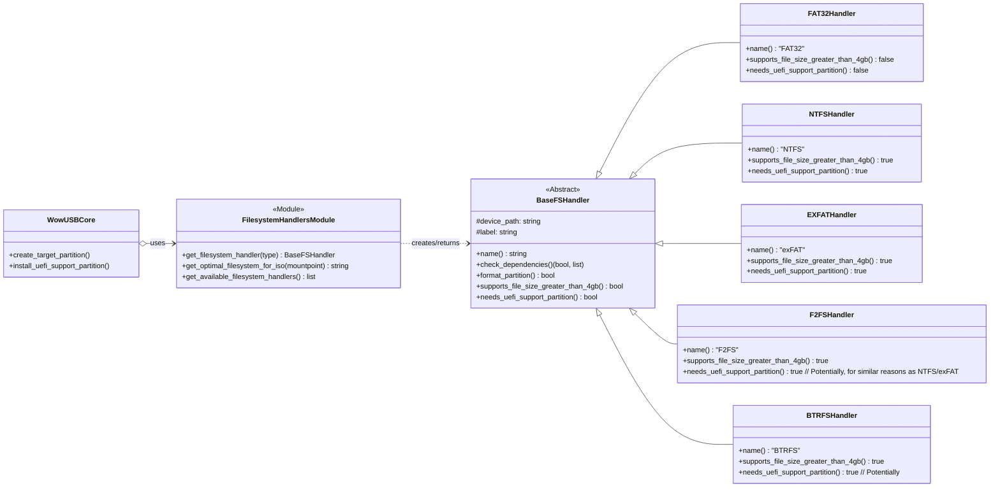

# WowUSB-DS9: Filesystem Handling (`WowUSB/filesystem_handlers.py`)

The `WowUSB/filesystem_handlers.py` module is responsible for abstracting the operations related to different filesystems that can be used on the target USB drive. This allows `WowUSB.core` to perform tasks like formatting, checking capabilities, and managing dependencies in a filesystem-agnostic way.

## 1. Core Concepts

*   **Abstraction:** Provides a common interface or pattern for interacting with various filesystem tools (e.g., `mkfs.fat`, `mkfs.ntfs`, `mkfs.exfat`).
*   **Encapsulation:** Each filesystem's specific logic (commands, dependency checks, capabilities) is encapsulated within its own handler.
*   **Extensibility:** Makes it easier to add support for new filesystems in the future by adding a new handler.

## 2. Expected Structure (Based on Usage in `core.py`)

While the actual `filesystem_handlers.py` file content isn't fully visible, its usage in `core.py` implies the following structure, likely involving a base class and specific implementations, or a factory pattern.

```python
# Conceptual structure - actual implementation might differ

class BaseFSHandler:
    def __init__(self, device_path, label):
        self.device_path = device_path
        self.label = label

    def name(self):
        """Returns the display name of the filesystem (e.g., "FAT32", "NTFS")."""
        raise NotImplementedError

    def check_dependencies(self):
        """
        Checks if necessary system utilities for this filesystem are installed.
        Returns: (bool_is_available, list_missing_deps)
        """
        raise NotImplementedError

    def format_partition(self):
        """Formats the self.device_path with the specific filesystem and self.label."""
        raise NotImplementedError

    def supports_file_size_greater_than_4gb(self):
        """Returns True if the filesystem supports files > 4GB, False otherwise."""
        raise NotImplementedError

    def needs_uefi_support_partition(self):
        """
        Returns True if this filesystem (when used for Windows installation)
        typically requires a separate small FAT32 partition for UEFI booting
        (e.g., for NTFS or exFAT to host UEFI bootloaders like UEFI:NTFS).
        """
        raise NotImplementedError

    def install_uefi_support_files(self, mount_point, temp_directory):
        """
        Installs necessary files for UEFI booting onto a support partition.
        (e.g., UEFI:NTFS drivers).
        This might be more coupled with WowUSB.bootloader or WowUSB.workaround in practice.
        """
        # This method's exact location/implementation might be more complex
        # and involve interaction with bootloader.py or data files.
        pass

class FAT32Handler(BaseFSHandler):
    def name(self): return "FAT32"
    # ... implementations ...

class NTFSHandler(BaseFSHandler):
    def name(self): return "NTFS"
    # ... implementations ...
    def needs_uefi_support_partition(self): return True # Typically

class EXFATHandler(BaseFSHandler):
    def name(self): return "exFAT"
    # ... implementations ...
    def needs_uefi_support_partition(self): return True # Often, for robust UEFI boot

# ... other handlers like F2FSHandler, BTRFSHandler ...

# Factory function or dictionary to get handlers
FILESYSTEM_HANDLERS = {
    "FAT": FAT32Handler,
    "FAT32": FAT32Handler,
    "NTFS": NTFSHandler,
    "EXFAT": EXFATHandler,
    # "F2FS": F2FSHandler,
    # "BTRFS": BTRFSHandler,
}

def get_filesystem_handler(fs_type_str, device_path, label):
    fs_type_upper = fs_type_str.upper()
    handler_class = FILESYSTEM_HANDLERS.get(fs_type_upper)
    if not handler_class:
        raise ValueError(f"Unsupported filesystem type: {fs_type_str}")
    return handler_class(device_path, label)

def get_optimal_filesystem_for_iso(source_fs_mountpoint):
    # Logic to check for large files in ISO, available system tools, etc.
    # Returns a string like "EXFAT", "NTFS", "FAT32"
    pass

def get_available_filesystem_handlers():
    # Returns a list of FS types for which dependencies are met
    pass

```

## 3. Key Functions in `filesystem_handlers.py` (as used by `core.py`)

*   **`get_filesystem_handler(target_filesystem_type)`:**
    *   Takes a string (e.g., "NTFS", "AUTO").
    *   Returns an instance of the appropriate filesystem handler class/object.
    *   Raises a `ValueError` if the type is unsupported.

*   **`get_optimal_filesystem_for_iso(source_fs_mountpoint)`:**
    *   Analyzes the content of the mounted Windows source (e.g., checks for files > 4GB using `utils.check_fat32_filesize_limitation`).
    *   Checks for available filesystem creation tools on the system (e.g., `mkfs.exfat`, `mkfs.ntfs`).
    *   Returns a string representing the recommended filesystem type (e.g., "EXFAT", "NTFS", "FAT32") based on a preference order (e.g., exFAT > NTFS > F2FS > BTRFS > FAT32 if large files are present and tools exist).

*   **`get_available_filesystem_handlers()`:**
    *   Returns a list of filesystem type strings (e.g., `["EXFAT", "NTFS", "FAT32"]`) for which the necessary formatting tools (dependencies) are currently installed on the user's system.

## 4. Filesystem Handler Instance Methods (Conceptual)

Each handler instance, once obtained via `get_filesystem_handler()`, would provide methods like:

*   **`handler.name() -> str`:**
    *   Returns the common name of the filesystem (e.g., "NTFS").
    *   Used for display messages.

*   **`handler.check_dependencies() -> (bool, list)`:**
    *   Checks if all required system utilities for creating/managing this filesystem are present (e.g., `ntfs-3g` for NTFS, `exfatprogs` or `exfat-utils` for exFAT).
    *   Returns a tuple: `(is_available: bool, missing_dependencies: list[str])`.
    *   `WowUSB.core` uses this to abort if dependencies are missing.

*   **`handler.format_partition(device_partition_path, filesystem_label) -> bool`:**
    *   The actual method signature might vary; `core.py` calls `create_target_partition` which then likely uses the handler.
    *   Executes the appropriate `mkfs` command (e.g., `mkfs.ntfs -L "MyLabel" /dev/sdb1`).
    *   Uses `WowUSB.utils.run_command` or similar for execution.
    *   Returns `True` on success, `False` on failure.

*   **`handler.supports_file_size_greater_than_4gb() -> bool`:**
    *   Returns `True` if the filesystem inherently supports files larger than 4GB (e.g., NTFS, exFAT, F2FS, BTRFS).
    *   Returns `False` for FAT32.

*   **`handler.needs_uefi_support_partition() -> bool`:**
    *   Indicates if, for reliable UEFI booting of Windows from this filesystem, a separate small FAT32 partition (like the one created by `core.create_uefi_ntfs_support_partition`) is recommended or required.
    *   Typically `True` for NTFS and exFAT when aiming for broad UEFI compatibility, as some firmware might only boot directly from FAT32 for UEFI. This partition would then host intermediate UEFI bootloaders like a version of GRUB or rEFInd that can load the NTFS/exFAT driver and then chainload Windows. The "UEFI:NTFS" project by Pete Batard is an example of such a mechanism.

*   **`handler.install_uefi_support_partition(fs_handler, target_device_partition_for_uefi_support, temp_directory)` (called from `core.py`):**
    *   This function in `core.py` takes the `fs_handler` itself. The handler might have a method that `core.py` calls, or `core.py` has the logic.
    *   If a filesystem like NTFS needs UEFI support files (e.g., `uefi-ntfs.img` from a project like Rufus/UEFI:NTFS, or custom GRUB setup), this step would copy them to the dedicated UEFI support partition (e.g., the second partition created by `create_uefi_ntfs_support_partition`).
    *   The files might be bundled in `WowUSB/data/bootloaders/`.

## 5. Interaction with `WowUSB.core`

1.  **Selection:** `core.main()` calls `get_optimal_filesystem_for_iso()` or uses the user-specified type.
2.  **Handler Retrieval:** It then calls `get_filesystem_handler()` to get an instance.
3.  **Dependency Check:** `core.main()` calls `handler.check_dependencies()`.
4.  **Capability Check:** `core.main()` calls `handler.supports_file_size_greater_than_4gb()` to validate against source ISO content.
5.  **UEFI Prep:** `core.main()` calls `handler.needs_uefi_support_partition()` to decide if `create_uefi_ntfs_support_partition()` and `install_uefi_support_partition()` are needed.
6.  **Formatting:** `core.create_target_partition()` (which is called by `core.main()`) uses the handler's formatting logic (e.g., `handler.format_partition()`).

## 6. UML Class Diagram (Conceptual)



This structure provides a clean and maintainable way to manage different filesystems within WowUSB-DS9. The actual implementation details within `filesystem_handlers.py` would fill in the specifics for each `mkfs` command and dependency check.
```
