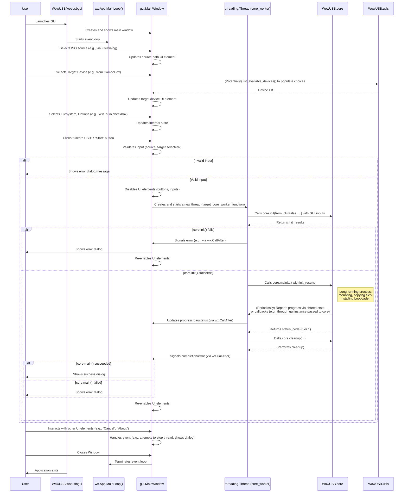

# WowUSB-DS9: GUI Flow

This document outlines the typical control flow and component interaction when a user interacts with WowUSB-DS9 via the graphical user interface (`woeusbgui`).

## 1. Entry Point: `WowUSB/woeusbgui`

The `WowUSB/woeusbgui` script is the entry point for the GUI application.

```python
# WowUSB/woeusbgui (simplified)
import subprocess
import sys
import os

if os.getuid() != 0:
    # Elevate privileges using pkexec if not root
    subprocess.run(["pkexec", os.path.realpath(__file__)])
else:
    try:
        import WowUSB.gui
        WowUSB.gui.run() # This is the main GUI application loop
    except SystemExit:
        # This block seems to be a fallback or specific handling for policy updates
        import WowUSB.utils
        WowUSB.utils.update_policy_to_allow_for_running_gui_as_root(__file__)
        print("Policy was updated, please run this program again")
```

**Key Actions:**

1.  **Privilege Check:** It first checks if the script is running as root.
2.  **Privilege Elevation:** If not root, it attempts to re-execute itself with root privileges using `pkexec`. This is necessary because operations like partitioning and writing to block devices require root access.
3.  **GUI Initialization:** If running as root, it imports `WowUSB.gui` and calls `WowUSB.gui.run()`. This function presumably initializes the wxPython application, creates the main window, and starts the GUI event loop.
4.  **Policy Update (Error/Fallback):** The `except SystemExit` block suggests a mechanism to update a Polkit policy if running the GUI as root initially fails due to policy restrictions. This is a specific setup detail.

## 2. GUI Application: `WowUSB.gui` (`gui.py`)

The `WowUSB.gui` module contains the implementation of the wxPython-based graphical interface.



**Flow and Component Interaction:**

1.  **Initialization (`WowUSB.gui.run()`):**
    *   Creates an instance of the wxPython `wx.App`.
    *   Creates the main application window (likely a class derived from `wx.Frame`, e.g., `MainWindow`).
    *   The `MainWindow` constructor will:
        *   Set up all UI elements: file pickers for source, dropdowns/list for target devices, radio buttons/checkboxes for filesystem type, options (WinToGo, label), progress bar, status text area, start/cancel buttons.
        *   Populate the target device list, possibly by calling a function like `WowUSB.utils.list_available_devices()`.
        *   Bind UI events (button clicks, selection changes) to handler methods.
    *   Shows the `MainWindow`.
    *   Starts the `wx.App.MainLoop()`, which listens for and dispatches UI events.

2.  **User Interaction & Configuration:**
    *   **Source Selection:** The user selects the Windows ISO file or DVD using a file dialog. The path is stored.
    *   **Target Selection:** The user selects the target USB device from a list. The device path (e.g., `/dev/sdb`) is stored.
    *   **Option Selection:** The user selects the target filesystem, enables/disables Windows-To-Go, sets a label, etc. These choices are stored.

3.  **Starting the USB Creation Process (e.g., "Start" button click):**
    *   **Input Validation:** The event handler for the "Start" button first validates the user's selections (e.g., source and target must be specified). If invalid, an error message is shown.
    *   **UI State Update:** The GUI disables input elements (source/target selection, options, Start button) to prevent changes during the operation. The Cancel button might be enabled.
    *   **Background Threading:** To prevent the GUI from freezing during the potentially long USB creation process, the actual work is delegated to a separate worker thread (`threading.Thread`).
        *   The handler creates a new thread. The target of this thread is a worker function.
        *   This worker function will call the necessary functions from `WowUSB.core`.

4.  **Worker Thread Execution:**
    *   **Core Initialization:** The worker thread calls `WowUSB.core.init(from_cli=False, source_media=gui_source, target_media=gui_target, ...)`, passing the parameters gathered from the GUI.
    *   **Core Main Logic:** If `core.init()` is successful, the worker thread calls `WowUSB.core.main(...)` (the older version, based on `core.py` structure, or a refactored version if `gui.py` directly uses the newer `main(args, temp_dir)` by constructing an `args`-like object).
        *   This `core.main` function performs the actual USB creation steps (mounting, formatting, copying, bootloader installation).
    *   **Progress Reporting:**
        *   The `WowUSB.core` module (specifically, the `ReportCopyProgress` thread started by `core.copy_filesystem_files`) needs a way to communicate progress back to the GUI thread.
        *   This is often done by passing the `gui` instance (or a specific callback handler object) to `WowUSB.core`.
        *   `WowUSB.core` (or `ReportCopyProgress`) then uses `wx.CallAfter(gui_update_function, progress_value, status_message)` to safely schedule UI updates (e.g., progress bar, status text) on the main GUI thread.
    *   **Completion/Error Handling:**
        *   Upon completion (success or failure) of `core.main(...)`, the worker thread signals the main GUI thread (again, likely using `wx.CallAfter`).
        *   The GUI thread then displays an appropriate message (success, error details) to the user.
    *   **Core Cleanup:** The worker thread calls `WowUSB.core.cleanup(...)`.
    *   **UI State Restoration:** The GUI re-enables the input elements.

5.  **Cancellation (e.g., "Cancel" button click):**
    *   If the user clicks "Cancel" while the operation is in progress:
        *   The GUI event handler sets a flag or uses a threading event that the worker thread checks periodically (e.g., `utils.check_kill_signal()` which would need to be connected to a GUI-controlled flag).
        *   The worker thread, upon detecting the cancel signal, should attempt to halt its current operation gracefully (e.g., stop copying, start cleanup).
        *   This can be complex to implement robustly, especially for stopping external processes.

6.  **Application Exit:**
    *   When the user closes the main window, the `wx.App.MainLoop()` terminates, and the application exits.
    *   Proper cleanup (e.g., ensuring worker threads are joined or terminated if the app is closed mid-operation) should be handled.

**Key Characteristics of GUI Flow:**

*   Event-driven, managed by `wxPython`'s main loop.
*   Separation of UI logic (`WowUSB.gui`) and business logic (`WowUSB.core`).
*   Crucial use of background threads for long-running tasks to maintain UI responsiveness.
*   Requires a mechanism for safe cross-thread communication (e.g., `wx.CallAfter` or other wxPython thread-safe event posting) to update UI elements from the worker thread.
*   Error handling involves displaying dialogs or messages to the user.
*   The `WowUSB.core` module is designed to be usable by both CLI and GUI, with parameters like `from_cli` and `gui` instance passed to it.

This architecture allows for a user-friendly graphical interface while leveraging the same underlying USB creation logic used by the CLI.
```
