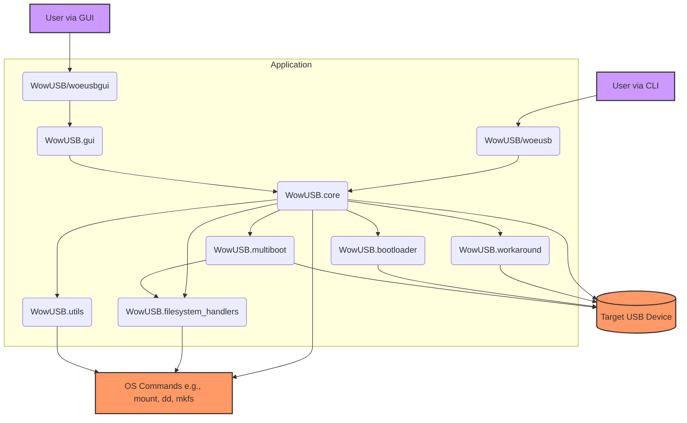

# WowUSB-DS9 Architecture Overview (as of 21 June 2025)

This document provides a high-level overview of the WowUSB-DS9 application architecture. It is based on the codebase state as of June 21, 2025, and aims to represent the actual implementation, including any stubs or placeholders.

## 1. Key Modules and Responsibilities

The application is primarily composed of the following Python modules and components within the `WowUSB/` directory:

*   **`woeusb` (CLI Entry Point):**
    *   Located at `WowUSB/woeusb`.
    *   Serves as the command-line interface for the application.
    *   Parses command-line arguments.
    *   Invokes the main processing logic in `WowUSB.core.run()`.

*   **`woeusbgui` (GUI Entry Point):**
    *   Located at `WowUSB/woeusbgui`.
    *   Serves as the graphical user interface entry point.
    *   Handles initial privilege elevation (e.g., using `pkexec`).
    *   Initializes and runs the wxPython-based GUI defined in `WowUSB.gui`.

*   **`WowUSB.core` (`core.py`):**
    *   The central module containing the main logic for creating bootable USB drives.
    *   **Key functions:**
        *   `init()`: Initializes parameters, sets up mount points and temporary directories. Handles argument parsing if invoked from CLI.
        *   `main()`: Orchestrates the entire USB creation process:
            *   Dependency checks.
            *   Source and target validation.
            *   Mounting source and target filesystems.
            *   Filesystem selection (including auto-detection and handling large files).
            *   Partition table creation and formatting (device mode).
            *   Copying files from source to target.
            *   Bootloader installation (legacy GRUB, UEFI support via filesystem handlers or specific workarounds).
            *   Windows-To-Go specific steps.
            *   Applying workarounds.
        *   `cleanup()`: Unmounts filesystems and removes temporary directories.
    *   Interacts with utility modules, filesystem handlers, and workaround modules.

*   **`WowUSB.gui` (`gui.py`):**
    *   Implements the wxPython-based graphical user interface.
    *   Provides user interaction elements for selecting source, target, and options.
    *   Likely invokes `WowUSB.core` functions in a separate thread to keep the UI responsive during long operations.
    *   Displays progress and status messages.

*   **`WowUSB.filesystem_handlers` (`filesystem_handlers.py`):**
    *   Provides an abstraction layer for handling different target filesystems (FAT32, NTFS, exFAT, F2FS, BTRFS).
    *   **Key functionalities (likely per handler):**
        *   Checking for necessary system utilities (e.g., `mkfs.exfat`).
        *   Formatting partitions.
        *   Determining support for large files (>4GB).
        *   Handling UEFI boot requirements (e.g., if a separate FAT32 boot partition is needed for NTFS/exFAT UEFI boot, like UEFI:NTFS).
    *   `get_optimal_filesystem_for_iso()`: Logic to auto-select a filesystem.
    *   `get_filesystem_handler()`: Retrieves the appropriate handler.

*   **`WowUSB.utils` (`utils.py`):**
    *   A collection of helper functions used across the application.
    *   Examples:
        *   Running external commands (subprocess management).
        *   Checking runtime dependencies.
        *   Device detection and information (`list_available_devices`).
        *   Filesystem utility checks (`check_mkfs_utility`).
        *   Mount/unmount operations.
        *   Size calculations and human-readable formatting.
        *   Colorized console output.

*   **`WowUSB.workaround` (`workaround.py`):**
    *   Contains functions to address specific issues or provide special handling.
    *   Examples:
        *   `support_windows_7_uefi_boot()`: Adjustments for Windows 7 UEFI compatibility.
        *   `buggy_motherboards_that_ignore_disks_without_boot_flag_toggled()`: Sets boot flag if needed.
        *   `bypass_windows11_tpm_requirement()`: Modifies registry/files for Win11 To-Go.
        *   `prepare_windows_portable_drivers()`: For Windows-To-Go.

*   **`WowUSB.multiboot` (`multiboot.py`):**
    *   Contains logic for creating multi-boot USB drives.
    *   Handles partitioning for multiple OSes and a shared data partition.
    *   Manages bootloader configuration for selecting different OSes.
    *   Coordinates with `core.py` and filesystem handlers for each OS installation.

*   **`WowUSB.miscellaneous` (`miscellaneous.py`):**
    *   Contains miscellaneous information like application version, internationalization setup (`i18n`).

*   **`WowUSB.bootloader` (`bootloader.py`):**
    *   Likely contains specific logic related to bootloader installation or management, possibly for different bootloader types (GRUB, UEFI boot files). The `core.py` references installing GRUB.

*   **`WowUSB.data/`:**
    *   Contains data files, potentially including:
        *   `bootloaders/`: May store precompiled bootloader files (e.g., UEFI:NTFS components).
        *   Icons, logos.

## 2. High-Level Component Interaction (Conceptual Diagram)



**Explanation of Interactions:**

1.  **User Interaction:** Users interact either through the `woeusb` CLI or the `woeusbgui` GUI.
2.  **Entry Points:**
    *   `woeusb` directly calls functions within `WowUSB.core`.
    *   `woeusbgui` initializes the `WowUSB.gui` framework, which then interacts with `WowUSB.core` to perform actions.
3.  **Core Orchestration:** `WowUSB.core` is the heart of the application. It uses:
    *   `WowUSB.utils` for common tasks (running commands, checks).
    *   `WowUSB.filesystem_handlers` to manage filesystem-specific operations (formatting, properties).
    *   `WowUSB.bootloader` and `WowUSB.workaround` for bootloader installation and applying specific fixes.
    *   `WowUSB.multiboot` if the multiboot mode is selected.
4.  **System Interaction:** Modules like `Core`, `Utils`, and `FSH` interact with the underlying operating system by invoking system commands (e.g., `mount`, `umount`, `parted`, `mkfs.*`, `grub-install`, `dd`).
5.  **Device Interaction:** The `Core`, `Workarounds`, `Bootloader`, and `Multiboot` modules directly or indirectly modify the target USB device (partitioning, writing data, installing bootloaders).

## 3. General Data Flow

1.  **Input:**
    *   Source: Path to Windows ISO file or DVD device.
    *   Target: Path to the target USB device (e.g., `/dev/sdX`) or partition.
    *   Options: Filesystem type, Windows-To-Go, workarounds, multiboot configurations.
2.  **Processing:**
    *   The source is mounted (read-only).
    *   The target device is prepared:
        *   Unmounted if necessary.
        *   Partition table created/wiped (in device mode).
        *   Partitions formatted according to the selected filesystem and options (e.g., main partition, UEFI support partition for NTFS, ESP for WinToGo).
    *   Files are copied from the mounted source to the mounted target partition.
    *   Bootloaders are installed:
        *   Legacy GRUB to the MBR and/or target filesystem.
        *   UEFI boot files copied/configured (e.g., to EFI System Partition or the main FAT32 partition).
    *   Workarounds are applied (e.g., modifying files on the target, setting disk flags).
3.  **Output:**
    *   A bootable USB drive.
    *   Status messages to the user (CLI or GUI).

This overview will be complemented by more detailed diagrams and explanations for specific parts of the application in subsequent files.
---
Next, I will create files for CLI flow, GUI flow, Core logic, Filesystem handling, and the data model.
I'll use Mermaid syntax for diagrams where appropriate, as it can be rendered in Markdown.
```
